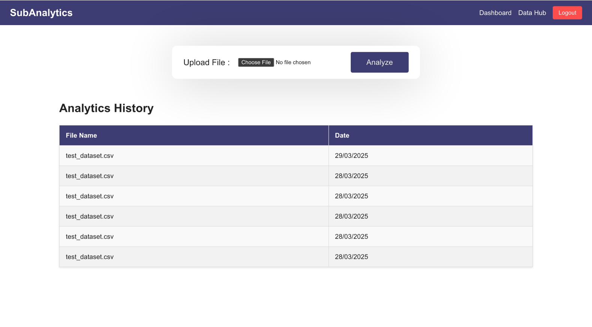
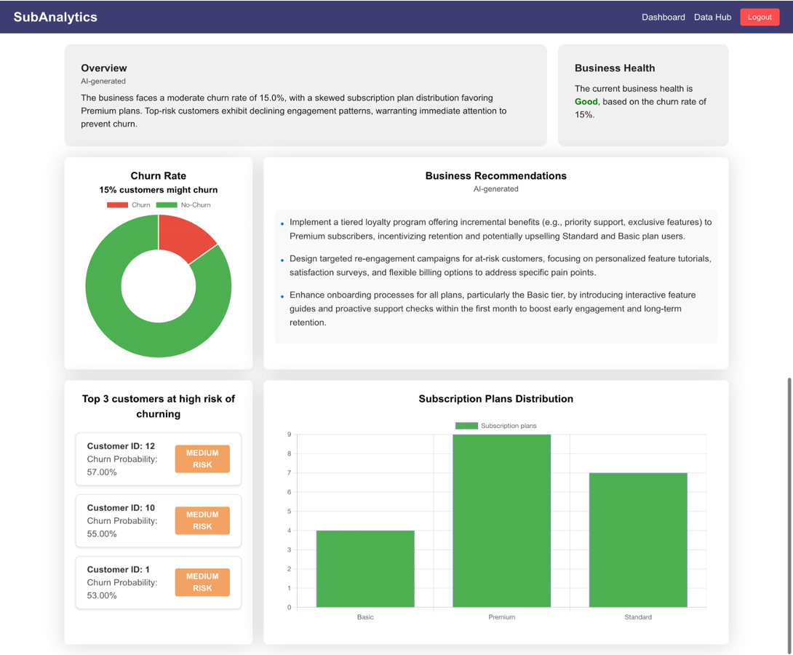

# Subanalytics

Subanalytics is a predictive analytics tool for SaaS businesses. It takes customer data from businesses in the form of CSV files and analyzes it to predict churn rate, identify the top-three customers with the highest churn probability, and show subscription plan distribution. It then generates actionable insights using a custom-built prediction model paired with NVIDIA’s LLaMA 3.1 Nemotron 70B Instruct language model to help reduce churn and improve business growth and customer retention.

---

## ✨ Features

* 🔐 **User Authentication** – Secure login with JWT-based auth (access & refresh tokens stored in cookies)
* 📁 **CSV Upload** – Upload customer data through the frontend
* 📊 **Churn Prediction** – Custom ML model (built with scikit-learn) predicts which customers are likely to churn
* 🧠 **AI-Powered Insights** – NVIDIA LLaMA 3.1 Nemotron 70B Instruct generates actionable suggestions to improve retention and reduce churn
* 📌 **Top At-Risk Customers** – Identify the top 3 customers most likely to churn
* 📈 **Subscription Plan Analytics** – Visual charts showing plan distribution and customer segmentation
* 🧾 **Dashboard View** – Clean, user-friendly dashboard showing all insights and data visualizations

---

## 🧑‍💻 Getting Started

### 📦 Prerequisites

Make sure you have the following installed:

* [Node.js](https://nodejs.org/) (v18+)
* [Python](https://www.python.org/) (3.8+)
* [MongoDB](https://www.mongodb.com/) (local or cloud)
* [npm](https://www.npmjs.com/)
* [pip](https://pip.pypa.io/)

---

### 🔧 Installation Steps

#### 1. Clone the repository

```bash
git clone https://github.com/your-username/subanalytics.git
cd subanalytics
```

---

#### 2. Backend Setup

```bash
cd backend
npm install
npm start
```

Create a `.env` file in the `backend/` directory:

```env
MONGO_URI=your_mongo_connection_string
JWT_SECRET=your_jwt_secret
TOKEN_EXPIRY=1d
PORT=5000
CORS_ORIGIN=http://localhost:5173  # or your frontend URL
```

---

#### 3. Frontend Setup

```bash
cd ../frontend
npm install
npm run dev
```

Create a `.env` file in the `frontend/` directory:

```env
VITE_API_URL=http://localhost:5000  # or your backend URL
```

---

#### 4. Flask Microservice Setup

```bash
cd ../flask-backend

# Create and activate a virtual environment
python -m venv venv
source venv/bin/activate  # On Windows: venv\Scripts\activate

# Install dependencies
pip install -r requirements.txt

# Run the microservice
python app.py
```

Create a `.env` file in the `flask-backend/` directory:

```env
NVIDIA_API_KEY=your_llama_nemotron_api_key
```

---

## 🚀 Usage

Once the app is running locally:

### 1. **Sign Up / Login**

* Navigate to the frontend (usually at `http://localhost:5173`)
* Register a new account or log in with existing credentials
* Authentication is handled securely using JWTs (access and refresh tokens)

### 2. **Upload Customer Data**

* After logging in, head to the dashboard
* Upload your customer data as a CSV file
* The file is sent to the backend and processed

### 3. **Get Predictions**

* The backend forwards the data to the Flask microservice
* A custom **scikit-learn** model predicts:

  * Overall churn rate
  * Top 3 customers at risk of churning
  * Subscription plan distribution

### 4. **AI-Powered Insights**

* The prediction results are passed to **NVIDIA LLaMA 3.1 Nemotron 70B**
* Business insights and actionable suggestions are generated
* Insights focus on churn reduction, retention strategies, and growth

### 5. **Visual Dashboard**

* View data breakdowns and charts powered by **Chart.js**
* See churn metrics, at-risk users, and subscription segmentation
* Use this data to inform business decisions

---

## 📂 Sample Data

To get started quickly or test the system, you can use the sample CSVs included in the repo:

* `demo_customer_data1.csv` & `demo_customer_data2.csv` – Well-structured datasets for trying out the full analytics flow

---

## 📸 Demo

### Upload & Data Hub  
  
*Upload customer CSV files and view previously uploaded datasets.*

### Dashboard  
  
*View churn predictions, subscription plan distribution, and top at-risk customers.*

---

## 🤝 Contributing

We welcome contributions to Subanalytics! Whether it’s bug fixes, feature requests, or improvements, feel free to submit a pull request.

### How to contribute:

1. Fork the repository
2. Create a new branch (`git checkout -b feature/your-feature-name`)
3. Make your changes and commit (`git commit -m 'Add some feature'`)
4. Push to your branch (`git push origin feature/your-feature-name`)
5. Open a pull request here

Please ensure:

* Your code follows existing style and conventions
* You include relevant tests for new features or bug fixes
* You update documentation if necessary

---

## 📬 Contact

For questions, feedback, or collaboration, feel free to reach out:

* **Email:** [tusharsrivastava2003@gmail.com](mailto:tusharsrivastava2003@gmail.com)
* **GitHub:** [tusharsrivastav](https://github.com/tusharsrivastav)
* **LinkedIn:** [Tushar Srivastava](https://www.linkedin.com/in/tushar-srivastava-739009223/)

---